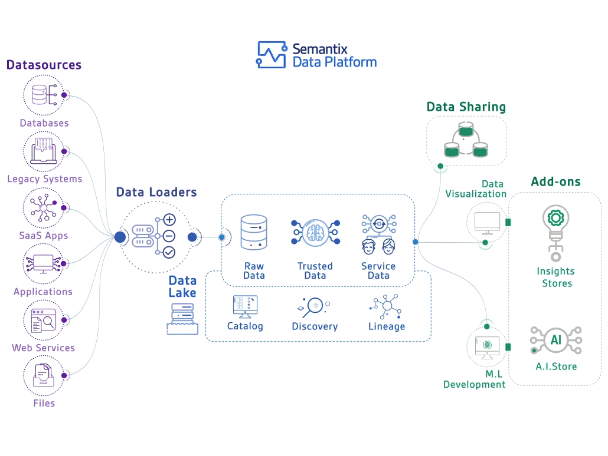

## Hola 👋

<picture> </picture>

Soy Yuu-Panki :smile: bienvenido a mi perfil de GitHub

Las tecnologias que mas uso:

 

 

Con las que juego:

 

Lo que curse de Desarrollo Web hace un tiempo:

Siente libre de usar este Repositorio como guía de consulta de distintos lenguajes de programación

### Proyectos

### Estadísticas

### Tecnologías

 

    <h4>CODE AND TOOLS</h4>
    
    
    
    
    
    
    

    <h4>BACK END</h4>
    
    
    
    
    
    

    <h4>FRONT END</h4>
    
    
    

    <h4>DATA BASE</h4>
    
    
    
    

    <h4>BIG DATA</h4>
    
    
    
    
    

   

    

